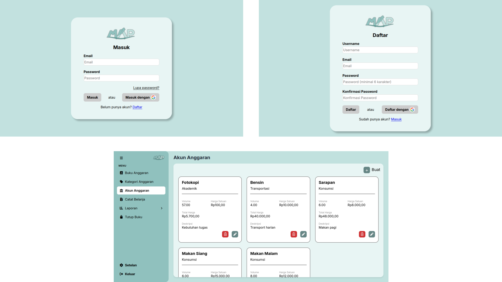
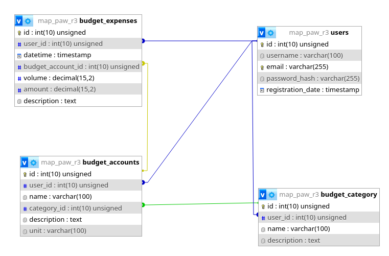

# MAP-PAW-R3



## Attention to Group Members

This web app uses the MVC architecture pattern. The files are separated into `/app` which is used to contain **backend-only** files that are inaccessible to users and `/public` which is used to contain user accessible (frontend) files.

**Please** put CSS and JS files that are used as the frontend in a clearly named directory that is a **direct child** of `MAP-PAW-R3/public/frontend`. Below is an example for the `budget-account` page:
```
/MAP-PAW-R3
└── public
    └── frontend
        └── budget-account
            ├── budget-account.css
            └── budget-account.js
```

Put PHP files that are used to render the HTML in a clearly named directory that is a **direct child** of `MAP-PAW-R3/app/views`. Below is an example for the `budget-account` page:
```
/MAP-PAW-R3
└── app
    └── views
        └── budget-account
            └── budget-account.php
```

The entire project structure roughly look like this:
```
/MAP-PAW-R3
├── app
│   ├── controllers
│   │   ├── AuthController.php
│   │   └── FrontController.php
│   ├── core
│   │   ├── config.php
│   │   └── Database.php
│   ├── models
│   │   └── UserModel.php
│   ├── utilities
│   │   └── AuthHelper.php
│   └── views
│       ├── auth
│       │   ├── login.php
│       │   └── signup.php
│       ├── budget-account
│       │   └── budget-account.php
│       └── skeleton
│           └── skeleton.php
└── public
    └── frontend
        ├── auth
        │   ├── auth.css
        │   └── auth.js
        ├── budget-account
        │   ├── budget-account.css
        │   └── budget-account.js
        └── more-pages-here
            ├── page.css
            └── page.js
```

## Page Skeleton
To make the UI between pages consistent, a `skeleton` branch is made to develop the page skeleton HTML structure along with the CSS and JS, which consists of the **page layout, container, sidebar, and modal window handler**. To use the skeleton, simply write every HTML elements, CSS, or JS that must go into the `container` div. [For a real example, take a look at this file](https://github.com/novela15/MAP-PAW-R3/blob/main/app/views/budget-account/budget-account.php), it only contains the HTML elements for the `budget-account` feature and will automatically wrapped between the skeleton parts by the `FrontController`.

To open a modal window from your feature page, [a modalUtils script](https://github.com/novela15/MAP-PAW-R3/blob/main/public/frontend/skeleton/modalUtils.js) is made to make handling modal windows feel consistent across pages. The script is loaded by the skeleton and to use it, simply call either `openModal()` or `closeModal()` in your script. Below is the documentation:

#### Opening a modal window:
```js
openModal(modal_file_name, item_id);
```
`modal_file_name`: The file name of the modal window (located in app/views/modal).<br>
`item_id`: The database primary key (ID) of the selected item that will be operated using the modal window. Only used for **read, update, and delete** operations.

#### Closing a modal window:
```js
closeModal();
```

## Running the Server
Run the project in a server, it's possible to use either XAMPP or Docker/Podman with an XAMPP image. Docker and Podman should be very similar to use.

**Note:** This web app is primarily developed using Podman.

### XAMPP
1. Start Apache and MySQL from the XAMPP Control Panel.
2. Put the entire server directory inside `C:\xampp\htdocs` (for Windows), `/opt/xampp/htdocs` (for Linux), or wherever else the XAMPP installation is.
3. Access the website from `http://localhost/server_dir`.<br>Access phpMyAdmin from `http://localhost/phpmyadmin/`.

### Docker
1. Pull [the Docker image](https://hub.docker.com/r/tomsik68/xampp/).
```bash
docker pull tomsik68/xampp
```
2. Run the image.
```bash
docker run --name myXampp -p 41061:22 -p 41062:80 -d -v ~/server_dir:/www tomsik68/xampp
```
3. Access the website from `http://localhost:41062/www`.<br>Access the XAMPP interface from `http://localhost:41062/`.<br>Access phpMyAdmin from `http://localhost:41062/phpmyadmin/`.

### Podman
1. Pull [the Docker image](https://hub.docker.com/r/tomsik68/xampp/).
```bash
podman pull docker.io/tomsik68/xampp
```
2. Run the image.
```bash
podman run --name myXampp -p 41061:22 -p 41062:80 -d -v ~/server_dir:/www tomsik68/xampp
```
3. Access the website from `http://localhost:41062/www`.<br>Access the XAMPP interface from `http://localhost:41062/`.<br>Access phpMyAdmin from `http://localhost:41062/phpmyadmin/`.

---

## Setting Up the Database



If you just started the server for the first time, the database need to be set up first or the app won't even be functional. To initialize the entire database, open phpMyAdmin, go to the SQL tab, copy [the entire SQL script file content](https://github.com/novela15/MAP-PAW-R3/blob/main/app/core/database_setup.sql), then click "Go".

It's also possible to use a [dummy database](https://github.com/novela15/MAP-PAW-R3/blob/main/app/core/dummy.sql) located in the same directory as the `database_setup.sql`. It has a single user with `a@a.a` as the email and `123123` as the password.

